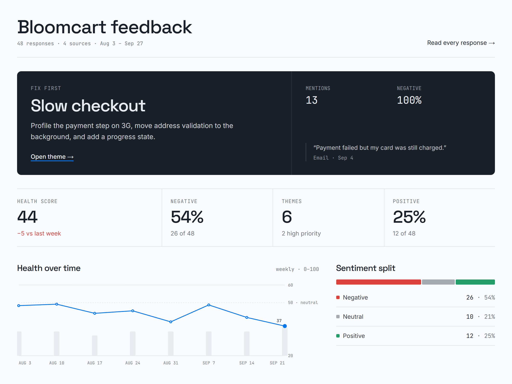
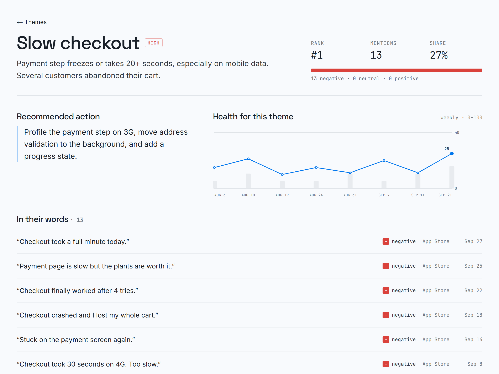
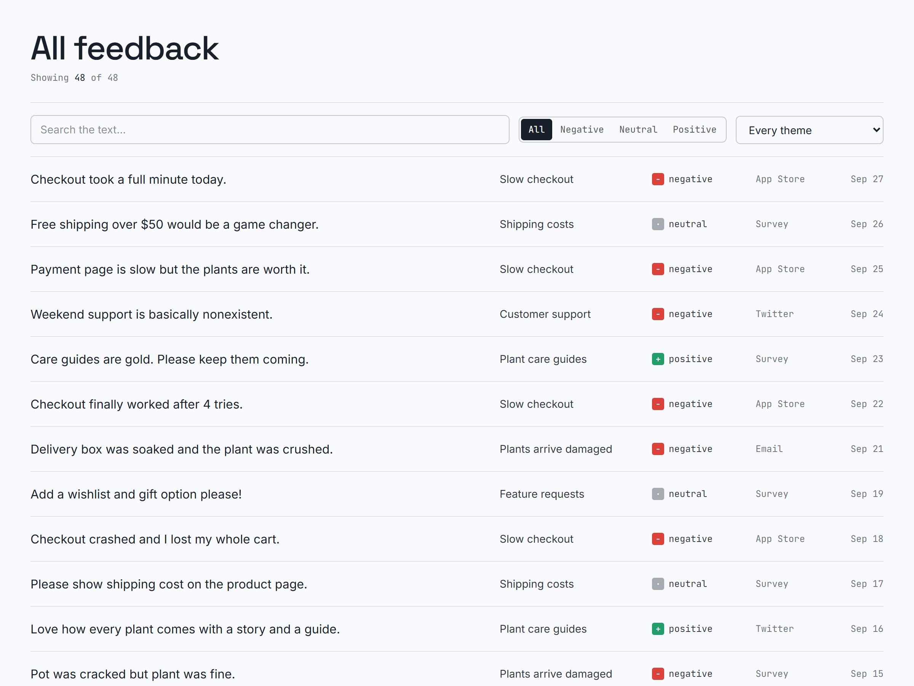

# Sift

**Every review, sorted by what to fix.**

Sift turns a pile of customer feedback (App Store reviews, support tickets, survey answers) into a short, ranked list of problems. Paste the text or upload a CSV. An AI model groups the responses into themes, scores each one from negative to positive, and puts the theme that is hurting you most at the top, with a recommended next step.



> The built-in demo uses **Bloomcart**, a fictional plant shop. All names, reviews and numbers in the sample are made up.

## Features

- **Fix first.** The costliest theme is pinned to the top of the overview. You see how often it comes up, how negative it is, the worst real quote, and one concrete action.
- **Themes ranked by impact.** Each theme is scored by how many people mention it, weighted by how unhappy they are, then tagged high, medium or low priority.
- **Health score over time.** Weekly sentiment on a 0–100 scale, with the change since last week. It needs dated feedback, which a CSV `date` column provides.
- **Theme detail.** A plain-language summary, the recommended fix, the weekly trend for that theme, and every response that belongs to it.
- **All feedback.** Search and filter every response by sentiment or theme, so you can check the grouping yourself.
- **Import.** Paste one response per line, or upload a CSV. Up to 200 responses per analysis.
- **⌘K / Ctrl+K** command palette to jump to any page or theme.
- **Works without an API key.** The sample dataset is pre-analyzed, so the whole app can be explored offline.

| Theme detail | All feedback |
| --- | --- |
|  |  |

## Tech stack

- [Next.js 16](https://nextjs.org) (App Router) + React 19 + TypeScript
- Tailwind CSS v4, with design tokens in OKLCH (`src/app/globals.css`)
- Any **OpenAI-compatible** chat completions API for the analysis (OpenAI, Gemini, and others)
- No database yet: imported datasets are kept in the browser's `localStorage`

## Getting started

```bash
npm install
cp .env.example .env.local   # then fill in your key, see below
npm run dev
```

Open http://localhost:3000. The landing page is at `/` and the app is at `/app`.

### Environment variables

| Variable | Required | Example |
| --- | --- | --- |
| `LLM_API_KEY` | yes, to analyze your own feedback | your provider's API key |
| `LLM_BASE_URL` | no (defaults to OpenAI) | `https://generativelanguage.googleapis.com/v1beta/openai` for Gemini |
| `LLM_MODEL` | no (defaults to `gpt-4o-mini`) | `gemini-2.5-flash` |

Without `LLM_API_KEY` the import page explains that analysis is off, and the sample dataset still works.

## Importing feedback

**Paste:** one response per line. Bullets and numbering are stripped automatically.

**CSV:** the first row must be a header.

| Column | Required | Accepted header names |
| --- | --- | --- |
| text | yes | `text`, `feedback`, `review`, `comment`, `message`, `body`, `content` (falls back to the first column) |
| source | no | `source`, `channel`, `platform` |
| date | no | `date`, `created`, `created_at`, `timestamp` |

Try it with the files in [`samples/`](samples/): `stride-reviews.csv` (46 dated reviews for a fictional running app) or `stride-reviews.txt` (25 lines to paste).

## How it works

1. **Parse.** Pasted text or CSV rows become `{ text, source, date }` items (`src/lib/parse.ts`).
2. **Analyze.** `POST /api/analyze` sends the batch to the model with one prompt. The prompt asks for 3–7 themes (name, summary, recommended action, priority) plus a sentiment label and a −1…1 score per response, returned as JSON (`src/lib/llm.ts`). The API key stays on the server.
3. **Rank.** Everything else is plain arithmetic in the browser (`src/lib/stats.ts`):
   - **impact** = the sum of how negative each response in a theme is, so frequent *and* angry beats rare or mild;
   - **health score** = the average sentiment mapped to 0–100 (50 = neutral), per week and overall.
4. **Store.** The analyzed dataset is saved in `localStorage` and can be picked from the sidebar.

## Project structure

```
src/
  app/
    page.tsx               landing page
    app/                   the product: overview, themes, theme detail, feedback, import
    api/analyze/route.ts   server route that calls the AI model
  components/              sidebar, charts, command palette, dataset context
  lib/
    llm.ts                 prompt + response validation (server only)
    stats.ts               impact, health score, weekly trend
    parse.ts               CSV / text parsing
    sample.ts              the Bloomcart demo dataset
    store.ts               localStorage persistence
samples/                   test files for the import page
```

## Roadmap

- Accounts and a database (Supabase) so datasets follow you across devices
- Pull reviews straight from the App Store, Google Play and Google Maps
- Better handling of mixed-language feedback (for example Indonesian + English)
- Export the fix list to Linear, Jira or CSV

## Author

Built by **Moch Virgiawan Caesar Ridollohi** ([mvirgiawancr on Contra](https://contra.com/moch_virgiawan_caesar_r_w19nvsk6)): full-stack developer building web apps, AI features and smart contracts.
